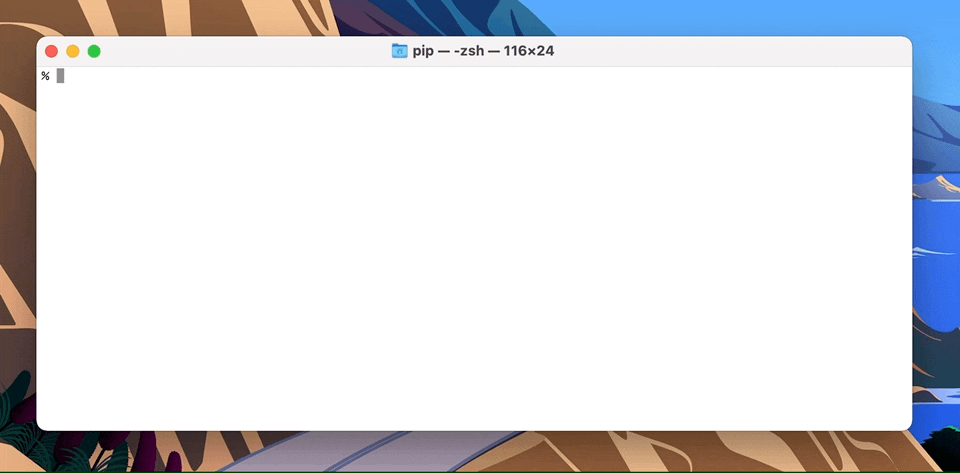

# XcodeNueve 🛠 9️⃣ 

A hack allowing the use of Xcode 9's toolchain on macOS Catalina, Big Sur, Monterey, and Ventura.



## Why?

Xcode 9.4.1 and the macOS 10.13 SDK are the last versions capable of building 32-bit Intel (`i386`) binaries.

Due to internal frameworks that reference private AppKit instance variables (removed in macOS Catalina), Xcode 9 and its included toolchain fail to run on any macOS version past Mojave.

For projects which need to build i386 binaries to support macOS 10.14 and earlier (like [Wine](https://www.winehq.org)), this requires keeping around a 10.14 build machine, which is undesirable for a number of reasons (no more security updates, requires older hardware, can't also run latest Xcode, etc.)

Xcode 9 also may be useful for building old Swift projects.

## What doesn't work?

Xcode.app itself does open, but crashes when trying to open a project (I think trying to access more private AppKit variables). This may be fixable, but isn't a priority for me.

## Tell me how!

1. Download Xcode 9.4.1 from [Apple Developer](https://developer.apple.com/download/all/) and extract it. I recommend renaming it to `Xcode9.app` and moving to `/Applications`.
2. Create a code signing signature (instructions courtesy of the [XVim project](https://github.com/XVimProject/XVim2/blob/master/SIGNING_Xcode.md)):
   1. Open Keychain Access.app and select `login` in the left pane.
   2. In the menu bar, select Keychain Access -> Certificate Assistant -> Create a Certificate...
   3. For the Name I recommend "XcodeSigner", for Identity Type select "Self Signed Root", and for Certificate Type choose "Code Signing". Then click "Create", and continue through the warning.
   4. You should now have a self-signed code signing certificate in the "login" keychain.
3. On macOS Ventura and later, you will need to give Terminal.app "App Management" permissions in the Privacy & Security pane of System Settings. This permission can be removed after the script is successfully run. 
4. Run the script from this repository and follow the prompts:  
   `/bin/sh -c "$(curl -fsSL https://raw.githubusercontent.com/mrpippy/XcodeNueve/master/XcodeNueve.sh)"`

## How do I use it?

* You'll need to set `DEVELOPER_DIR=/Applications/Xcode9.app` and `SDKROOT=/Applications/Xcode9.app/Contents/Developer/Platforms/MacOSX.platform/Developer/SDKs/MacOSX10.13.sdk`, then run `clang`/`gcc`/`xcrun`/`xcodebuild`/whatever.
* The `env` command can be used to run this as a single command, like `env DEVELOPER_DIR=/Applications/Xcode9.app SDKROOT=/Applications/Xcode9.app/Contents/Developer/Platforms/MacOSX.platform/Developer/SDKs/MacOSX10.13.sdk clang -arch i386 ...`
* Also, on Apple Silicon, you will need to explicitly run the command emulated under Rosetta, using `arch -x86_64`. I usually find it easier to just run the entire shell emulated: `arch -x86_64 zsh`.
* Building i386 binaries is considered cross-compiling, and may need additional options passed to a `configure` script/build system.
* For example, here's a typical invocation of `configure` on Apple Silicon:  
  `arch -x86_64 ./configure --host=i386-apple-darwin CC="env DEVELOPER_DIR=/Applications/Xcode9.app SDKROOT=/Applications/Xcode9.app/Contents/Developer/Platforms/MacOSX.platform/Developer/SDKs/MacOSX10.13.sdk clang -arch i386"`

## Details

Here's the error you get when trying to run unmodified Xcode 9 (either the IDE itself or its command-line tools) under macOS Catalina and later:

```
% DEVELOPER_DIR=/Applications/Xcode9.app xcrun clang -v
dyld[83886]: Symbol not found: _OBJC_IVAR_$_NSFont._fFlags
  Referenced from: /Applications/Xcode9.app/Contents/SharedFrameworks/DVTKit.framework/Versions/A/DVTKit
  Expected in: /System/Library/Frameworks/AppKit.framework/Versions/C/AppKit
```

## Who's reponsible for this?

Brendan Shanks  
[CodeWeavers](https://www.codeweavers.com)
